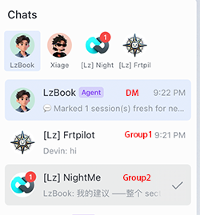
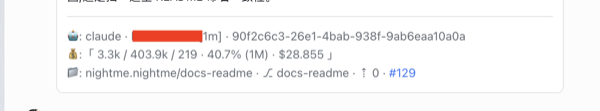

# NightMe

<p align="center">
  
</p>

> **Sleep tight. NightMe codes all night.**
>
> A remote-pair developer agent. No more babysitting AI—stay in the loop from your phone while it takes the wheel.

[English](./README.md) · [简体中文](./README.zh-CN.md)


## What is NightMe

**NightMe** drives your local AI Coding Agents — Claude Code, Codex, DSH (DeepSeek Harness), Pi, OpenCode, etc. — from chat. Send a message in any connected chat platform; NightMe routes it to the right agent process and returns the reply as a structured card.

Multiple chats run in parallel — one per project. Multiple agents work in parallel, each on its own task — switching between them is instant, no cold restart. `git` worktree work is hardened into `Git Team Workflow` (`/gtw`): fix / push / pr / close / sync — each step is one IM reply card, integrated with GitHub, GitLab, and similar platforms. NightMe doesn't replace your agent subscriptions or memory; it sits in front of them and keeps them warm.

## Why NightMe

### One chat, one CWD, one project

You work across multiple projects at once. Each chat in a connected chat channel — group or DM — is a **ChatSession**, and each ChatSession has a **CWD** — its current working directory. The CWD *is* the project: set it with `/cwd <path>`, change it anytime. Multiple chats run in parallel, each bound to its own directory. See [Chat Channels](#chat-channels) for the channels available today.

```
                       You (any chat channel)
                                  │
                                  ▼

    ┌─ ChatSession ─┐  ┌─ ChatSession ─┐  ┌─ ChatSession ─┐
    │ CWD: ~/a      │  │ CWD: ~/b      │  │ CWD: ~/c      │
    │               │  │               │  │               │
    │ AI Agents:    │  │ AI Agents:    │  │ AI Agents:    │
    │   Claude Code │  │   Claude Code │  │   Claude Code │
    │   Codex       │  │   Codex       │  │   Codex       │
    │   Pi          │  │   Pi          │  │   Pi          │
    │   OpenCode    │  │   OpenCode    │  │   OpenCode    │
    │   DSH         │  │   DSH         │  │   DSH         │
    └───────────────┘  └───────────────┘  └───────────────┘

   ▲ CWD = project; agents run inside that CWD; all parallel from one NightMe instance ▲
```



**Project isolation is by directory.** Each ChatSession's CWD is independent — re-running `/cwd` changes which directory a session operates on, without affecting the others. Multiple projects stay
live simultaneously.

**The differentiator vs traditional tools** (Hermes, openclaw, cc-connect, happycoder): they activate one session at a time. NightMe runs all your projects in parallel from a single instance. Switching chats is instant — same daemon, no cold start, no re-init.

### Three core capabilities

| Capability | What it means in practice |
|---|---|
| **Multiple Chat Sessions in parallel** | N sessions on one machine, each running a different project or task. |
| **CWD = project** | Each ChatSession is bound to one current working directory — that directory *is* the project. Set it with `/cwd <path>`; switch anytime. |
| **Multi-agent, in the same Chat** | `/use <agent>` swaps the active agent. The previous one keeps running in the background — its task continues, results still come back, but new messages route to the new active agent. |

## Supported integrations

NightMe works with the AI coding agents you already use and the chat
apps you already live in. Here's what's available today — and what's on
the way.

### AI Coding Agents

| Agent | Status |
|---|---|
| **Claude Code** | Available |
| **Codex** | Available |
| **Pi** | Available |
| **DSH** (DeepSeek Harness) | Available |
| **Cursor** | Available |
| **OpenCode** | Available |

### Chat Channels

| Channel | Status |
|---|---|
| **Feishu** (China) / **Lark** (International) | Available — `nightme login feishu` |
| **Telegram** | Beta — `nightme login telegram` |
| **Slack** | Coming soon |

## Prerequisites

- **macOS, Linux, or Windows** — NightMe ships as a single Go binary. The
  default Linux build is fully static with no runtime dependencies; see
  [Linux: tray-less by default](#linux-tray-less-by-default) if you want the
  system-tray icon.
- **A chat channel** — see [Chat Channels](#chat-channels) for what's supported today. `nightme login feishu` registers via QR scan; `nightme login telegram` walks through the BotFather token setup.
- **At least one local AI Coding Agent** — Claude Code, Pi, OpenCode, Codex, or DSH (DeepSeek Harness). Install the CLI and have it on your `$PATH`; NightMe spawns it as a subprocess.

## Install

Three ways to get `nightme` on your machine:

1. **One-liner** (recommended):

   **macOS / Linux:**
   ```bash
   curl -fsSL https://nightme.dev/install.sh | bash
   ```

   **Windows (PowerShell):**
   ```powershell
   powershell -c "irm https://nightme.dev/install.ps1 | iex"
   ```

   Drops the latest release into a stable location on your `$PATH`
   and runs `nightme version` to verify. On Linux this installs the
   tray-less build — see [below](#linux-tray-less-by-default).

2. **Prebuilt binary** (manual):

   - Grab the archive for your platform from the
     [latest release page](https://github.com/cnlangzi/nightme/releases/latest)
     (e.g. `nightme_<version>_darwin_amd64.tar.gz`,
     `nightme_<version>_linux_amd64.tar.gz`,
     `nightme_<version>_windows_amd64.zip`)
   - Extract it — the binary inside is just `nightme`
     (or `nightme.exe` on Windows):
     ```bash
     tar -xzf nightme_<version>_darwin_amd64.tar.gz
     mv nightme /usr/local/bin/nightme
     chmod +x /usr/local/bin/nightme
     ```
     On Windows, unzip and place `nightme.exe` somewhere on your `PATH`.
   - Linux also publishes a `-gui` archive per architecture — see
     [below](#linux-tray-less-by-default).

3. **From source** (for development or to pin a commit):

   ```bash
   git clone https://github.com/cnlangzi/nightme.git
   cd nightme
   make dev
   ```

   `make dev` runs nightme directly from source using the example
   config in `./configs/`. For a proper release-style build (with
   the Windows icon embedded, macOS menu-bar template icons, and
   version metadata baked in), use `make build` or `make release`.

4. **macOS .app bundle** (optional, for the menu-bar experience):

   A bare `nightme` binary on macOS still works, but the menu-bar
   icon falls back to the generic executable glyph. To get the
   proper icon, build the .app bundle:

   ```bash
   make build              # bin/nightme + cmd/nightme/assets/trayTemplate.icns
   make app-bundle         # dist/NightMe.app
   cp -R dist/NightMe.app /Applications/
   open /Applications/NightMe.app
   ```

   The .app has `LSUIElement=true`, so it shows no Dock entry —
   just the menu-bar icon. Closing the app from the menu (Stop /
   Quit) gracefully exits the daemon.

   config — no separate build step needed.

### Linux: tray-less by default

Linux publishes **two archives per architecture**:

| Archive | Tray icon | Runtime dependencies |
| --- | --- | --- |
| `nightme_<version>_linux_<arch>.tar.gz` | no | none — fully static |
| `nightme_<version>_linux_<arch>-gui.tar.gz` | yes | `libgtk-3-0`, `libayatana-appindicator3-1` |

The default archive is the one `install.sh` fetches, and it is what you want on
a server. It is a fully static binary that links nothing, so it runs on any
Linux host regardless of distro, glibc version, or installed packages.

The system-tray icon needs GTK3 and AppIndicator, which are libraries a
headless server has no reason to carry. Shipping them as a hard requirement
meant the binary could not start *at all* on a bare server — not even
`nightme version` — because the dynamic loader refuses the process before any
code runs:

```
nightme: error while loading shared libraries: libayatana-appindicator3.so.1:
cannot open shared object file: No such file or directory
```

So the tray is opt-in on Linux. If you run NightMe on a desktop and want the
icon, install the `-gui` archive over your existing one — the binary inside is
also named `nightme`, so nothing else changes:

```bash
sudo apt install libgtk-3-0 libayatana-appindicator3-1   # Debian / Ubuntu
tar -xzf nightme_<version>_linux_amd64-gui.tar.gz
sudo mv nightme /usr/local/bin/nightme
```

Building from source follows the same split — `make build` gives you the
tray-less binary, `make build-gui` gives you `bin/nightme-gui` (needs
`libgtk-3-dev` and `libayatana-appindicator3-dev`).

Nothing is lost by running tray-less: the daemon is controlled over its Unix
socket, so `start` / `stop` / `restart` / `status` / `logs` and the REPL all
behave identically. macOS and Windows are unaffected — their tray backings ship
with the OS, so the tray is always built in.

---

## Quickstart

```bash
nightme login feishu   # prints a QR code; scan with the Feishu mobile app
nightme start          # daemon runs in the background
```

When `start` returns, NightMe sends a welcome message to your Feishu DM — that's how you know you're live.

### CLI commands

Most of the time you live in chat. These are the few things you do from a terminal:

| Command | What it does |
|---|---|
| `nightme start` / `stop` / `restart` | Turn NightMe on and off. Your agents keep working either way. |
| `nightme status` | Is NightMe running? |
| `nightme list` | All your agents: which chat, which project, still alive or finished. |
| `nightme kill` | Stop every agent at once. Send a message in the chat and it comes back, conversation intact. |
| `nightme logs` | Watch what NightMe is doing, live. |
| `nightme doctor` | Check NightMe's health when something feels off. |
| `nightme agents` | Which AI agents you have set up. |

Stopping comes in three scopes: `/close` (one project) · `nightme kill` (all agents) · `nightme stop` (NightMe itself). Your conversations survive all three.

---

## Always-in-the-loop

You always know what your agent is doing, where, and at what cost — every reply carries a fixed footer with what you need to know, without leaving chat. Most other "AI dev in chat" tools feel like a black box; NightMe treats visibility as a first-class feature.

### StatusBar — pinned to every Feishu reply



Every reply carries a fixed footer showing exactly what you need to know without leaving chat:

- **CWD** — which ChatSession is active (the "project")
- **Git status** — branch, dirty / clean, ahead / behind
- **Agent status** — `idle` / `running` / `thinking`
- **Token usage** — used / limit for the current session

Other tools drop you into the dark. NightMe shows you what your agent is doing, where, and at what cost.

### Flexible visibility — you decide what to see

| Toggle | What it controls |
|---|---|
| `/think on\|off` | Show or hide the agent's thinking blocks. |
| `/tools on\|off` | Show or hide per-tool thread replies (default off). |
| `/watch on\|off` | Listen to all group messages, not just `@bot` / `@_all`. |

**Why this matters:** NightMe defaults to visible. Toggle things off when you want quiet — your choice, no surprises.

---

## What we do differently


| Feature | Openclaw / Hermes | NightMe |
|---|---|---|
| Sessions survive daemon restart | ❌ | ✅ |
| Real `/stop` and `/steer` | ❌ | ✅ |
| No server-side timeout | 30 min | none |
| Clean prompts, no preamble | ❌ | ✅ |

The four differentiators, in short:

1. **Sessions survive.** Daemon restart, network blip, sleep — your chat picks up where it left off. The upstream CLI's session resumes via `--resume <session-id>`.

2. **You can stop or redirect, mid-task.** `/stop` halts the in-flight turn. `/steer <msg>` redirects. Both keep your session and context intact.

3. **No clock on you.** If Claude runs 30 minutes, NightMe runs 30 minutes. You're in charge of when to stop.

4. **No prompt padding.** No preamble, no brand voice, no injected system message. The CLI sees just your words.

We sit in front of Claude / Codex / DSH (DeepSeek Harness) / Pi / OpenCode. You stay in control. Nothing in a black box.

---

## Shell mode

You don't always need the agent to run a shell command. With Claude Code / Codex, asking the agent to run something goes through the agent's tool loop — long chain, eats context, nudges your real task aside while the agent's busy reading shell output.

`!cmd` skips all that. Type `!make test` and NightMe runs the command in the chat's CWD directly. The result comes back as a plain IM card. No agent, no round trip, no context eaten.

For the scripts you already have — `make`, `npm test`, deploy hooks. Anywhere the agent's reasoning adds nothing but a delay.

```
✅ $ make test
exit 0 · 12ms · ~/work/foo
stdout:
  All tests passed
```

## Git Team Workflow (`/gtw`)

`git worktree` gives you isolated branches per task. `gh pr create` gives you a one-shot PR. AI agents give you on-demand coding help. `/gtw` glues the three together — each `/gtw <cmd>` is a slash command that spins up a **short-lived agent** for the heavy lifting and returns a clean IM card. The agent runs once, does the work, and exits. Your main chat stays clean.

GitHub / GitLab issues are the task flow — each `/gtw fix` pins to an issue, and the work moves through the issue's state as the subcommands fire.

### The local dev loop: fix → hooks → close

Three subcommands chain into a complete **local multi-branch development workflow**. Run 3 of these in parallel — three issues, three worktrees, three agents, no state collision.

> **`/gtw sync` is NOT part of this loop.** `sync` (a.k.a.
> `git checkout main && git pull --rebase origin main`) is a
> **main-repo operation** — it switches the current branch to
> main and pulls. Don't call it from inside a worktree; it
> refuses to run there by design. Both **`/gtw fix`** (step 1)
> and **`/gtw close`** (last step) already call sync internally
> on the main repo before / after the worktree operation, so
> you don't need to call sync manually. After `close`, main is
> fresh; the next `fix` starts from that.

1. **`/gtw fix -n <branch>`** — opens a fresh worktree named
   `<branch>` on your just-up-to-date main, runs a one-shot
   agent to do the work. Pure local — no GitHub issue needed.
   You keep chatting in your main chat.

   For the GitHub / GitLab flow, use `/gtw fix <issue-id>` to
   pin the worktree to a remote issue. First-time use on a new
   repo just works — no setup needed.

2. **hooks fire automatically** — the dev environment rebuilds
   itself in the new worktree. CodeGraph re-indexes, `npm install`
   / `go mod download` / `cargo build` — whatever your project
   needs. Edit `~/.nightme/gtw.yml`:

   ```yaml
   # ~/.nightme/gtw.yml
   fix:
     hooks:
       after:
         - codegraph init                # bare string = shell hook
         - npm install
         - go mod download
   ```

3. (You work. Agent on demand. Or just edit files yourself.)

4. **`/gtw close`** — when the task is done (or you decide not
   to), `/gtw close` tears down the worktree, returns you to
   main, and the branch is ready to ship (or discard).

### Hooks — bring the dev environment with you

AI tool indexes (CodeGraph, language servers, caches) usually live inside the repo. Each worktree is a fresh checkout — they all need rebuilding. Hooks automate that.

The common case is `fix: hooks: after` — fires right after
`/gtw fix` opens a new worktree, rehydrating the dev env
in-place:

```yaml
# ~/.nightme/gtw.yml
fix:
  hooks:
    after:
      - tokensave branch add "$GTW_BRANCH" --path "$GTW_REPO_ROOT"
      - codegraph init                # re-index the new worktree
      - npm install                   # install deps
      - go mod download               # download Go modules
close:
  hooks:
    before:
      - tokensave branch remove "$GTW_BRANCH" --path "$GTW_REPO_ROOT"
```

Each command (not just `fix`) exposes `hooks.before` and
`hooks.after`:

| Hook | When it fires | Typical use |
|---|---|---|
| `before` | before the main flow | record starting SHA, snapshot state |
| `after` | after the main flow (always runs, even on failure) | re-index, install deps, warm caches |

Iron rules (from the code):

- v1 supports **shell hooks only** — anything else warns + skips.
- Hook failures **never block the main flow**. Failed hook = `⚠️`
  note in the reply, main command proceeds.
- All stdout/stderr is echoed back so you can see what actually ran.
- 30s default timeout per hook.

## Slash commands

Chat-level slash commands. The `/gtw` subcommands live in
[their own section](#git-team-workflow-gtw) and are not listed
here.

| Command | What it does |
|---|---|
| `/cwd <path>` | Bind this chat to a workspace. Validates the path; lazy-spawns on the next message. |
| `/use <agent>` | Switch the active agent (`claude` / `codex` / `dsh` / `opencode` / `pi`). The previous one keeps running in the background — its task continues, results still come back, but new messages route to the new active agent. |
| `/stop` | Halt the in-flight turn on the selected agent. Session stays; queued messages still flow. |
| `/steer <msg>` | Stop the in-flight turn and prepend `<msg>` to the queue. The steered message becomes the first thing the agent sees on the next turn. |
| `/close [agent]` | Terminate the bridge process(es) for AgentSession(s) in the current workspace. The AgentSession entry is preserved; next user message triggers a respawn that replays `--resume <sessionID>` to continue the conversation. |
| `/new [agent]` | Reset the agent's conversation context (Claude Code's `/clear` equivalent). Process stays alive; queued messages are cleared. |
| `/watch on\|off` | Per-chat message-watch mode (default: only `@bot` / `@_all` in groups). |
| `/think on\|off` | Show or hide the agent's thinking blocks in the receipt card. |
| `/tools on\|off` | Show or hide per-tool thread replies (default off to keep the card quiet). |
| `/help` | List every slash command in-chat. |

`!cmd` runs shell commands directly in the chat's CWD — see
[Shell mode](#shell-mode) for the rules.

Anything that doesn't match a slash command (or `!cmd`) is
forwarded to the active agent as a regular prompt — same as
sending the message in Claude Code's own CLI. NightMe doesn't
intercept or transform; the agent receives the message verbatim
and runs its own built-in slash commands (e.g. Claude Code's
`/clear`, `/compact`, `/init`, etc.).

## For developers


```
┌─────────────┐    ┌─────────────┐    ┌──────────────────────────┐
│  Channel    │ →  │  Gateway    │ →  │  ChatSession (per chat)   │
│  (Feishu,   │ ←  │  (router +  │ ←  │  ├─ AgentSession pool     │
│   Web TUI)  │    │   binding)  │    │  │  (agent, cwd) 1:1       │
└─────────────┘    └─────────────┘    │  ├─ InputBuffer FSM       │
                                     │  ├─ readPump              │
                                     │  └─ EventHandler          │
                                     │           ↓               │
                                     │  AgentSession → Bridge    │
                                     │     (PTY / ACP / SDK /    │
                                     │      JSON-IO / RPC)       │
                                     │           ↓               │
                                     │       Agent CLI           │
                                     └──────────────────────────┘
```

- **Channel** owns transport.
- **Gateway** routes inbound. The `inbound` subpackage owns the slash-command dispatch chain; everything else is forwarded to the ChatSession's active AgentSession.
- **ChatSession** is the per-chat context. Owns the AgentSession pool and the InputBuffer FSM. Persists across daemon restarts.
- **AgentSession** is the per-CLI-process handle. One per `(agent, cwd)` pair, kept alive across `/use` and `/cwd` switches.
- **Bridge** is the per-agent transport — one of `acp`, `claudecode`, `codex`, `dsh`, `opencode`, `pi`, or `pty` (under `internal/bridge/`), picked by what the CLI supports.

See [`docs/SPEC.md`](./docs/SPEC.md) §1 for the full responsibility table and [`docs/SPEC.md`](./docs/SPEC.md) §0.1 for the v1.3 "Channel is a dumb renderer" rewrite.

### Configuration

NightMe reads YAML from `~/.nightme/config.yaml` (or `$NIGHTME_CONFIG` if set). Env-var overrides: `NIGHTME_<SECTION>_<KEY>` (e.g. `NIGHTME_PRIMARY`).

```yaml
primary: claude                          # global default agent

agents:                                  # each entry = name / bridge / command
  - name: claude
    bridge: claude
    command: "claude --dangerously-skip-permissions"
  - name: codex
    bridge: codex
    command: codex
  - name: opencode
    bridge: opencode
    command: opencode
  - name: pi
    bridge: pi
    command: "pi"
  - name: dsh
    bridge: dsh
    command: dsh

feishu:
  app_id: "cli_xxxxxxxxxxxxxxxx"
  app_secret: "xxxxxx…xxxx"
  verification_token: ""
  encrypt_key: ""

session:                                 # initial PTY + aggregator tunables
  default_pty_cols: 80
  default_pty_rows: 24
  output_chunk_size: 4096        # bytes
  output_flush_interval_ms: 200  # milliseconds

logging:
  level: "info"          # debug | info | warn | error
  file: ""               # empty = stdout; path = file

paths:
  data_dir: "~/.nightme"  # chat_sessions.json + agent_sessions.json root
```

The `/gtw` workflow reads a **separate** file: `~/.nightme/gtw.yml` — see the [Git Team Workflow section](#git-team-workflow-gtw) above.

See [`configs/nightme.example.yaml`](./configs/nightme.example.yaml) for the full schema and per-bridge notes.

Logs go to `~/.nightme/nightme.log` (mode `0600`) as JSON. Attribute keys containing `secret`, `token`, or `password` are auto-redacted to `***REDACTED***`.

### Documentation

| Doc | What |
|---|---|
| [`docs/PRD.md`](./docs/PRD.md) | Product definition — what / why / for whom. No tech. |
| [`docs/SPEC.md`](./docs/SPEC.md) | Technical architecture — components, data flow, NFRs. |
| [`docs/FEATURES.md`](./docs/FEATURES.md) | Feature index — every F-XX in one table. |
| [`docs/WFE.md`](./docs/WFE.md) | Workflow YAML + engine runtime architecture — triggers, steps, bot↔wfe boundary. |
| [`docs/feat/`](./docs/feat/) | Per-feature design docs. |
| [`docs/bridge/`](./docs/bridge/) | Per-agent bridge design: claude, codex, dsh, opencode, pi. |
| [`docs/channel/feishu.md`](./docs/channel/feishu.md) | Feishu adapter reference (rendering rules, card semantics, thread routing). |
| [`docs/flow/`](./docs/flow/) | Cross-cutting flow docs (e.g. the 3-layer doc model). |
| [`docs/E2E_TESTING.md`](./docs/E2E_TESTING.md) | Manual Feishu round-trip + troubleshooting. |
| [`CHANGELOG.md`](./CHANGELOG.md) | Current snapshot (single `[Unreleased]` section). |
| [`MIGRATION.md`](./MIGRATION.md) | Breaking changes between earlier snapshots. |

### Development

```bash
make build     # ./bin/nightme with version metadata
make test      # go test -race ./...   (~20 packages, race-tested)
make lint      # go vet ./...          (0 warnings required by CI)
make install   # go install to $GOBIN
make dev       # go run ./cmd/nightme  (uses example config)
```

CI runs on GitHub Actions (`.github/workflows/ci.yml`) for every push and pull request: `go vet`, `go test -race`, and `go build` must all pass.

### Project layout

```
cmd/nightme/                       # cobra CLI (start / stop / restart / status / logs / doctor / test / config / list / login / agents / name)
configs/                           # example YAML config
docs/
  PRD.md SPEC.md FEATURES.md       # 3-layer doc model
  WFE.md                           # workflow YAML + engine runtime (schema / triggers / steps / bot↔wfe)
  feat/                            # F-XX per-feature design
  bridge/  channel/  flow/         # per-subsystem design
  images/                          # README-served screenshots
internal/
  agent/                           # Agent / AgentEvent / Info / Starter interface
  agentsession/                    # AgentSession + Prompt + Spawner (per-CLI-process runtime unit)
  bridge/                          # Bridge abstraction, one sub-package per agent
    acp/  claudecode/  codex/  dsh/  opencode/  pi/  pty/
  channel/                         # Channel interface
    bot/  echo/  feishu/  telegram/   # adapters (feishu + telegram are production)
  chatsession/                     # ChatSession + pool manager + persistence
  cli/                              # shared CLI helpers (config / doctor / login)
  command/                         # Slash-command Commander / Registry / Factory
    cwd/ close/ newcmd/ use/ think/ tools/ watch/ stop/ steer/ services/
    gtw/                           # /gtw fix / hooks / sync / close (worktree workflow)
  config/                          # YAML loader + env overrides
  daemoncontrol/                   # IPC for `nightme doctor` / `status`
  errors/                          # CodedError + ExitCode
  gateway/                         # Slash router + binding + receipt FSM
    inbound/  outbound/            # inbound dispatch chain + outbound sender
  gatewaytest/                     # integration test harness
  logging/                         # slog + secret redaction
  login/                           # IM bot registration — feishu/ handles QR login for Feishu / Lark
  messages/                        # IM message types + dispatch
  prcache/                         # PR metadata cache (per-F-50)
  registry/                        # JSON-backed chat_sessions.json + agent_sessions.json (0600, atomic)
  shell/                           # `!cmd` shell-mode dispatcher
  statusbar/                       # Feishu footer-card stamp runtime (per F-58, F-133)
  testdata/                        # shared test fixtures
  version/                         # build-time version metadata
```

### Exit codes

| Code | Meaning |
|------|---------|
| 0 | Success |
| 1 | Generic / unmapped error |
| 2 | Config error |
| 3 | Auth error |
| 4 | Channel error |
| 5 | Session error |
| 6 | Agent error |
| 7 | Bridge error |
| 8 | Validation error |
| 9 | Not found |

---

## Contributing

PRs and issues are welcome. The full guide lives in
[`/docs`](./docs/) — see the [3-layer doc model](./docs/README.md)
for the design workflow.

Thanks for building with NightMe — we want more **channels**
(Slack, Web TUI, anything) and more **AI Coding Agents**
(Claude Code, Codex, DSH (DeepSeek Harness), Pi, Cursor, OpenCode, anything else) to plug in.
Drop a `Channel` / `Bridge` and the architecture handles the rest.

Contact the maintainer:

- Twitter: [@imlangzi](https://x.com/imlangzi)
- WeChat: `langzi` (please mention "NightMe" when adding)

---

## License

[MIT](./LICENSE) — see [`LICENSE`](./LICENSE) for the full text.
