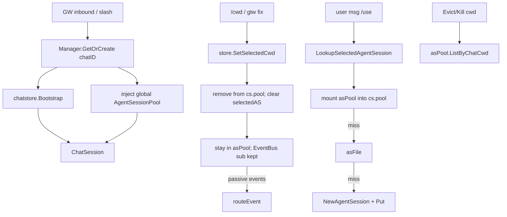

# ChatStore — ChatSession 单一来源与 AgentSession 按需挂载

> **Status**: 已在本分支落地（不分 PR1/PR2）
> **Scope**: `chat_sessions.json` 真相源、ChatSession 创建/hydrate、全局 AgentSessionPool、`/cwd` 换子集
> **读者**: 参与 runtime / gateway / chatsession / chatstore / command 的工程师
> **Related docs**:
> - [SPEC.md](./SPEC.md) §1.2 三层 FSM、§1.3 不变式
> - [feat/F-chat-session.md](./feat/F-chat-session.md) ChatSession 模型
> - [feat/F-CHATSTORE-001-chat-session-persistence.md](./feat/F-CHATSTORE-001-chat-session-persistence.md) lost-update 修复与 Store 抽出（本设计的前提，尚需按本文收完）
> - [feat/F-62-inflight-cwd-home.md](./feat/F-62-inflight-cwd-home.md) cwd 边界与 in-flight
> - [CHANNEL.md](./CHANNEL.md) 多 channel + lazy GetOrCreate

---

## 0. 摘要

ChatSession 由 channel 的 **chatID** 驱动，经 gateway 的 `GetOrCreate` 创建或重建。**`internal/chatstore.Store` 是 CS 持久化状态的唯一来源**。AgentSession 一旦建立，所属 `(ChatSessionID, Agent, Cwd)` 不可变；cwd 变化不是改 AS，而是换一批主动工作集。

全局 **`AgentSessionPool`**（key = `chatID + cwd + agent`）持有 live/warm AS。`cs.pool` 只挂载当前 `selectedCwd` 上可**主动**交互的子集。`/cwd` 只停止对旧子集的主动交互；旧 AS 留在 asPool warm，**被动事件仍经 `routeEvent` 全量处理**。切回同一 key 时原样对接。

| # | 决策 | 理由 |
|---|------|------|
| **D1** | chatstore 是 CS 字段唯一写入口（`Bootstrap` / `SetXxx` / `Get`） | 消除 CS 副本 + `Save(entryLocked())` 双写与 lost-update |
| **D2** | CS 只由 GW `GetOrCreate(chatID)` 创建；启动不做 `RestoreFromRegistry` | 与 CHANNEL lazy 契约一致；避免每 channel Manager 灌全站 chat |
| **D3** | 全局 asPool + 按需 Lookup 挂载；`/cwd` 拆主动关系、保留 warm | 切回不丢 handle；CS 工作集 = 当前 cwd |
| **D4** | 主动 / 被动分离：不向 warm Submit；warm 事件不丢弃 | 后台回合仍出站；用户新消息只打当前子集 |
| **D5** | Evict/Kill(cwd) 以 asPool 为准；Watchdog 仅跟随 `selectedAS` | 漏杀与误 disarm 的两个硬坑 |

---

## 1. Motivation

### 1.1 现状问题（与目标不一致处）

对照目标模型审计当前代码，主要偏差：

1. **创建不纯**：`WireRuntimeCallbacksAndRestore` 仍调用 `RestoreFromRegistry`，每个 channel Manager 启动灌全站 chat；`constructChatSession` miss 时 `New` 而不 `Bootstrap`；`findChatSession` miss 时会对所有 mgr `GetOrCreate`。
2. **真相源混乱**：`ChatSession` 自持 `selectedCwd` 等字段，setter 改副本再 `persistChatEntry` → `Store.Save` 整表覆盖；`chatstore.SetXxx` 生产几乎不用；shutdown `persistChatStates` 再把 CS 投影回 store。F-CHATSTORE-001 要修的 lost-update 仍在生产路径上。
3. **cwd ≠ 换子集**：`SetSelectedCwd` 注释写明 pool preserved；`hydrateFromEntry` 按 `ChatSessionID` 挂上该 CS **所有** cwd 的 AS；`PumpEvents` 订阅整池。
4. **AS 身份**：对象字段不可变基本成立；关系层把多 cwd AS 长期堆在同一 `cs.pool`，与「chatID+cwd → 一批 AS」冲突。entry 仍写死字段 `AgentSessionIDs` / `SelectedAgentSessionID`。

### 1.2 设计原则（产品/架构）

- ChatSession 的创建由 channel 消息进来后 GW 驱动，并通过 chatID 初始化或重建。
- chatstore 是 create/load 的 ChatSession **状态**的唯一地方。
- ChatSession 建立后，cwd 被 `/cwd` 修改 → 重置其主动 agentsession 子集；从 asPool 按 `chatID+cwd+agent` 捞取，或 Lookup 时 lazyCreateOrLoad。
- AgentSession 一旦建立，所属 chatID+cwd（及 agent）不可更改；任一变化即新 AS。
- 切走的 AS **保持 warm**，可动态切回；不主动交互，但被动信息照样响应。

---

## 2. 目标模型



| 概念 | 职责 |
|------|------|
| `chatstore.Store` | `chat_sessions.json`；CS 路由字段的唯一读写 |
| `AgentSessionPool` | 进程内 live/warm AS；key = `chatID+cwd+agent` |
| `agent_sessions.json` (asFile) | AS 磁盘索引；非 live handle |
| `cs.pool` | 当前 `selectedCwd` 上**主动**工作集 |
| `cs.subs` + EventBus | 订阅；`/cwd` **保留**，保证 warm 被动事件不断 |

---

## 3. 主动 vs 被动

| | 主动（仅 `cs.pool` / `selectedAS`） | 被动（warm 也做） |
|---|---|---|
| 含义 | CS/用户**发起** | AS **推回来** |
| 包含 | Lookup 选中、Submit、Steer Stop、TryFlush **投递目标**、prober 扫描 | `routeEvent`：AgentEvent→出站、PromptEnded→writeback、Lifecycle→SetExited/RestartFromDeath |
| `/cwd` 后 | 旧 AS 不再当目标 | 订阅保留，事件仍进同一 CS |

### 3.1 Watchdog 例外（必要）

`ArmHungPrompt` / `disarmHungPrompt` 是 **per-CS** 状态。warm 的 PromptEnded/Lifecycle **不得** disarm/arm 当前会话的 HungPrompt。仅当 `as == cs.selectedAS` 时动 Watchdog。否则 A（warm）结束回合会清掉 B 上已 arm 的挂起检测。

本轮不把 Watchdog 改成 per-AS；用 selected 守卫即可。

### 3.2 TryFlush

`TryFlush` 已只读 `selectedAS`。切 cwd 时 Clear queue 后，warm PromptEnded 触发的 TryFlush 为空转，无需再按 `as ∉ cs.pool` gate。

### 3.3 出站元数据

AgentEvent 出站 footer / AgentBar 必须用 **envelope 里的 `AgentSession`**，禁止回退 `cs.SelectedAgentSession()`，避免 warm 回复贴错 cwd/agent 栏。

---

## 4. 不变量

1. CS 只由 GW `GetOrCreate(chatID)` 创建/重建。启动不调用 `RestoreFromRegistry`。
2. CS 持久化字段只经 `chatstore.Store`：`Bootstrap` / `Get` / `SetXxx`。禁止生产路径 `Save(cs.Entry())` 整表覆盖。
3. `cs.pool` ⊆ 当前 `selectedCwd` 的主动工作集。其它 cwd 的 AS 在 asPool warm（除非 Evict/kill）。
4. 切回同一 key `chatID+cwd+agent` → 同一 `as.ID` + live handle（**进程内**；跨 daemon 重启无 live warm，只能 asFile→Detached→spawn）。
5. 不向 warm AS 主动发新用户回合；warm 被动事件不丢弃（Watchdog 副作用除外，见 §3.1）。
6. AS 身份 `(ChatSessionID, Agent, Cwd)` 不可变；任一变化即新 AS。
7. 不主动 prober warm；其 Lifecycle 事件仍走 `routeEvent`（含 `RestartFromDeath`）。
8. **Evict / Kill(cwd) 以 asPool 为准**，不能只扫 `cs.pool`。

---

## 5. chatstore — CS 状态唯一源

### 5.1 API（保持 / 用足现有）

| 方法 | 用途 |
|------|------|
| `Bootstrap(chatID, primaryAgent)` | miss 创建；hit 返回已有（不覆盖 SelectedAgent/Cwd；可 bump LastInteractionAt） |
| `Get` / `List` | 读（返回拷贝） |
| `SetSelectedCwd` / `SetSelectedAgent` / `SetWatchMode` / `SetThinkMode` / `SetToolsMode` / `SetWatcherHintEmitted` | 字段写；持 store 锁至 `save()` 结束 |

生产 **不再** 调用 `Save` 整表写入（Bootstrap 内部与测试 seed 除外）。

### 5.2 ChatSession 侧

- 删除（或停止作为写路径）：`persistChatEntry` / `persistChatEntryLocked` / 生产用 `entryLocked` 写盘。
- 删除 shutdown [`persistChatStates`](../internal/runtime/shutdown.go)。
- `SetSelectedCwd` 等 → `cs.csStore.SetXxx(cs.ChatID, …)`；成功后再做 runtime 侧效应。
- Getter 读 store，或 Set 成功后回填的**只读 cache**（cache 禁止当第二写入口）。热路径可加单字段读，避免每次 deepCopy。
- 删除 entry 死字段写入：`AgentSessionIDs`、`SelectedAgentSessionID`（Unmarshal 忽略旧 JSON 即可）。对齐 F-CHATSTORE-001 D3。

### 5.3 创建与 hydrate

[`constructChatSession`](../internal/chatsession/manager.go)：

1. `store.Bootstrap(chatID, primaryAgent)`。
2. 新 entry：seed `SelectedAgent = primaryAgent`。已有 entry：**不覆盖** SelectedAgent / PrimaryAgent / SelectedCwd。
3. **不 attach 任何 AS**（按需挂载）。
4. 注入 `cs.asPool`。
5. `ChatSession.ID` 与 Bootstrap 写入的 `entry.ID` **同一公式**（统一 `"cs_"+chatID` **或** 统一 `deriveIDFromChatID`，禁止两套）。该 ID 是 asFile 的 `ChatSessionID` FK，**不是** asPool key。

生产去掉 `WireRuntimeCallbacksAndRestore` 末尾的 `RestoreFromRegistry`。测试改走 `GetOrCreate`。

[`findChatSession`](../internal/runtime/runtime.go)：只 `Get`，禁止 `GetOrCreate`。无 CS 的 reaction → no-op（接受）。

### 5.4 锁序

1. 先完成 `store.SetXxx`（内部持 store 锁），返回后再持 `cs.mu` 改 `cs.pool` / `selectedAS`。
2. **禁止**持 `cs.mu` 调用 asFile / store 落盘。
3. `Lookup`：`cs.mu` 与 `asPool.mu` 顺序固定并文档化；asFile I/O 在两把锁外。

---

## 6. 全局 AgentSessionPool

建议包内文件：`internal/chatsession/aspool.go`（或等价）。

### 6.1 Key（写死）

顺序：**chatID → cwd → agent**。三段缺一不可。

```go
type asPoolKey struct {
	ChatID string
	Cwd    string // filepath.Clean 后入 key
	Agent  string
}

type AgentSessionPool struct {
	mu    sync.RWMutex
	byKey map[asPoolKey]*AgentSession
}

func (p *AgentSessionPool) Get(chatID, cwd, agent string) *AgentSession
func (p *AgentSessionPool) Put(chatID string, as *AgentSession) // key={chatID, Clean(as.Cwd), as.Agent}
func (p *AgentSessionPool) Delete(chatID, cwd, agent string)
func (p *AgentSessionPool) ListByChatCwd(chatID, cwd string) []*AgentSession
```

- `Get` / `Put` / `Delete` / `ListByChatCwd` 入口一律 `filepath.Clean(cwd)`。
- 进程级单例：runtime 构造一次 → `Manager.WithAgentSessionPool` → `GetOrCreate` 注入每个 `cs.asPool`。
- 多 channel Manager **共享**同一 pool（chatID 已 `oc_` / `tg_` 前缀，不撞）。
- asFile = 磁盘；asPool = live。重启 asPool 空 → Lookup miss 时从 asFile hydrate（Detached）再 Put。

### 6.2 登记表

| 动作 | asPool | cs.pool / subs |
|------|--------|----------------|
| Lookup 新建 / asFile hydrate | Put | mount；`attachAgentSubscription`（idempotent） |
| `/cwd` 离开 | **保留**（warm） | 仅移出 `cs.pool`、`selectedAS=nil`；**保留 `cs.subs` + EventBus handler** |
| `/cwd` 回来 | Get | 再入 `cs.pool`；subs 已在则不二次 Subscribe |
| Evict / Drop / kill | **Delete** | 移出 cs.pool；**清该 as 的 subs**；Close；asFile.Delete |

保留 `cs.subs` 的目的：被动事件不断；切回不二次 Subscribe。

---

## 7. cwd 切换与按需挂载

### 7.1 `SetSelectedCwd` / `ClearSelectedCwd`

`store.SetSelectedCwd` 成功后：

1. 当前 `cs.pool`：只移出 map + `selectedAS = nil`。不 Close、不 asFile.Delete、不 asPool.Delete、**不清 `cs.subs`**、不 Unsubscribe。
2. **不**批量预挂载新 cwd。
3. `cs.queue.Clear()` + drop（避免 A 的排队消息打进 B）。旧 selected 的 `ClearInFlight` 可保留（F-62）。
4. **禁止**按 `as ∉ cs.pool` 丢弃 `routeEvent` 事件。

切回旧 cwd：只改 store 的 `selectedCwd` + 清空当前 `cs.pool`；下一条消息 Lookup → asPool Get → 挂回 → 主动对接恢复。其间若有事件，本就一直在 route。

### 7.2 `LookupSelectedAgentSession`（lazyCreateOrLoad）

服务当前 `(selectedAgent, selectedCwd)`：

1. `cs.pool` Running hit → 用（`selectAgentSessionLocked`）。
2. `asPool.Get(chatID, Clean(cwd), agent)` → 入 `cs.pool` → 按需 spawn。
3. asFile：按 `ChatSessionID + Clean(Cwd) + Agent` 查（`List`+filter 或 helper）→ `FromAgentSessionEntry` → Put → mount → spawn。
4. `NewAgentSession` → Put + asFile.Upsert → mount → spawn。

### 7.3 `routeEvent` / PumpEvents / Prober

- `routeEvent`：AgentEvent / writeback / Lifecycle 对 warm **全开**；Watchdog 仅 `as == selectedAS`。
- PumpEvents：只扫 `cs.pool` 做*新*挂载；warm handler 已在，不必扫 asPool。
- Prober：只扫 `cs.pool`（本轮不扩展 warm prober）。

### 7.4 Evict / Drop / Kill

- `EvictAgentSessionsInCwd(cwd)` / 按 cwd 的 Kill：受害者 = **`asPool.ListByChatCwd(cs.ChatID, cwd)`**（并清理仍在 `cs.pool` 的引用），**不是**只 `cs.AgentSessionsInCwd`。
- 对每个：Close（若活）→ 移出 `cs.pool` → `asPool.Delete` → asFile.Delete → 清 `cs.subs`（仅销毁路径）。
- `/gtw close`：`Evict(worktree)` → `SetSelectedCwd(repoRoot)`。
- `/cwd`、`/gtw fix`：**禁止** Evict。

### 7.5 命令调用点

| 命令 | 行为 |
|------|------|
| `/cwd` | 只 `SetSelectedCwd` |
| `/gtw fix` | `SetSelectedCwd(worktree)`；repoRoot AS 留 asPool warm |
| `/gtw close` | Evict(worktree) → `SetSelectedCwd(repoRoot)` |
| `/use` | `SetSelectedAgent` + Lookup 按需挂载 |

---

## 8. 实施分期

### PR1 — chatstore SoT + 消息驱动创建 + 注入 pool

- `constructChatSession` → Bootstrap；hydrate 不 attach AS；注入 asPool；统一 CS ID。
- 去掉生产 `RestoreFromRegistry`；`findChatSession` 只 Get。
- setter/getter 走 store；删 persistChatEntry 写路径与 `persistChatStates`；删死字段写入。
- 锁序落地。

PR1 单独合入后：多 cwd 不再在 hydrate 时灌进 `cs.pool`（空池直到 Lookup）。asPool API 可先就位，完整 rebind 语义在 PR2。

### PR2 — 拆主动关系；按需挂载；Evict 打 asPool；Watchdog 守卫

- `SetSelectedCwd` 拆 `cs.pool` / 清 queue；Lookup 三级挂载。
- `routeEvent` Watchdog 守卫；出站用 envelope AS。
- Evict/Kill 扫 asPool。
- 命令路径对齐；测试补齐。

---

## 9. 测试锚点

| # | 断言 |
|---|------|
| T1 | Wire 后 `mgr.List()` 空；不再 Restore |
| T2 | GetOrCreate → store 立刻有 entry（Bootstrap）；hydrate 后 `cs.Pool()` 空直至 Lookup；CS `ID` == as entry `ChatSessionID` |
| T3 | A→spawn→B：`cs.Pool()` 无 A；asPool 有 A；A 仍推 AgentEvent → 出站发生且 AgentBar = A 的 cwd/agent；再 `/cwd A`+Lookup → 同一 `as.ID` |
| T4 | warm A PromptEnded **不** disarm 当前 B 上已 arm 的 HungPrompt |
| T5 | Evict(cwd) 能杀掉 **仅在 asPool、不在 cs.pool** 的同 cwd AS；asPool+asFile 无残留 |
| T6 | `SetWatchMode` 与 `SetSelectedCwd` 并发，磁盘非 torn |
| T7 | `findChatSession` 未知 chatID → nil |
| T8 | `/gtw close`：worktree 从 asPool 消失；repoRoot 可 warm 挂回 |

---

## 10. 禁止与刻意不做

### 禁止

- 改 AS 的 `Cwd` / `ChatSessionID` / `Agent`。
- `/cwd` 调用 Evict 或清理 asPool。
- hydrate / GetOrCreate 时按 ChatSessionID 全量 attach AS。
- 丢弃 warm 被动事件；为 warm 做 EventBus Unsubscribe。
- Evict 只扫 `cs.pool`。
- warm 事件动 Watchdog；出站用 `SelectedAgentSession()` 元数据。
- 生产 `Save(cs.Entry())` 整表覆盖。

### 刻意不做（本轮）

- EventBus 真 Unsubscribe；`routeEvent` 丢弃 gate。
- warm 的主动 prober 扫描；Watchdog 改 per-AS。
- 抽出 `agentstore`。
- `/cwd` 时 spawn 或批量预挂载该 cwd 全部 agent。
- 跨 daemon 保留 live warm。
- 改 bridge / `--resume` 语义。
- `cs.pool` 收成只按 agent 索引（可选后续）。

---

## 11. 与既有文档的关系

| 文档 | 关系 |
|------|------|
| F-CHATSTORE-001 | 抽出 Store、修 lost-update、删死字段——**必要但未完成**；本文要求生产路径真正改走 `SetXxx`，并去掉 CS 双写与 shutdown Save |
| CHANNEL.md lazy restore | 与「启动不 Restore、GetOrCreate 驱动」对齐；本文补 Bootstrap + 不 hydrate AS |
| F-62 | cwd 边界 ClearInFlight；本文扩展为拆主动子集 + asPool warm |
| F-61 | Lifecycle respawn 对 warm 仍走 routeEvent；prober 仍只扫主动池 |
