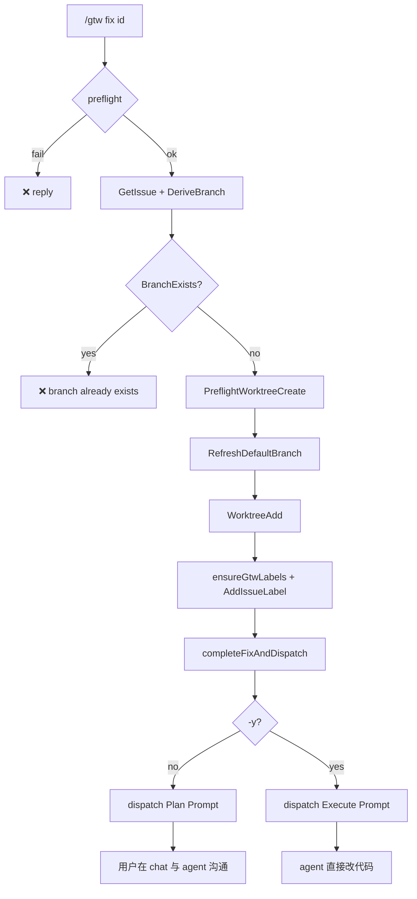

# F-XX: `/gtw fix` — Plan-first dispatch + 分支硬失败

> **Status**: 实现已落地（PR-A + PR-B 合并到 `fix-gtw-fix` 分支）
>
> **Related**: [`F-gtw.md`](./F-gtw.md)、[`F-59-gtw-label-bootstrap.md`](./F-59-gtw-label-bootstrap.md)、[`internal/command/gtw/README.md`](../../internal/command/gtw/README.md)（IM 排版规约）
>
> **Code anchors**: `internal/command/gtw/fix.go`、`cmd.go::parseFixArgs`、`buildIssueDispatchText`

---

## 0. TL;DR

`/gtw fix <issue-id>` 的职责边界收窄为：

1. 拉取 issue → 建 worktree + 打 `nightme/wip` label
2. 组装 issue 信息（正文 + 附件 ContentFile）
3. 按 flag 选择 **Plan** 或 **Execute** prompt，`QueueUserMessage` 发给 agent

**到此结束。** 后续的「看方案、确认、调整、开工」全部在 **用户 ↔ agent 普通对话** 里完成。gtw **不提供** `/gtw proceed`，也不再 dispatch 第二次 prompt。

| 命令 | Agent 收到 | 用户下一步 |
|---|---|---|
| `/gtw fix <id>`（默认） | **Plan Prompt** — 只分析、出方案，**禁止改文件** | 在 chat 里回复 agent（「可以 / 按第 2 步做」等） |
| `/gtw fix <id> -y` | **Execute Prompt** — 直接实现修复 | 跟进 agent 进度 |

**Branch 已存在 → 硬失败**，不再提供 🆕 -v2 / 🔗 加入 / daemon recovery re-entry。

---

## 1. Motivation

### 1.1 旧行为的问题

v1.x Remote 模式在 worktree 就绪后立刻 dispatch 一条混合语义的 prompt（`buildIssueDispatchText` §Task 段同时写 "investigate **and implement**" 与 "reply when you have a plan"）。Agent 常直接改代码，用户无法在 IM 里先看方案再授权。

同时 §5.3.1 **branch-exists 决策卡**（🆕 用 -v2 新分支 / 🔗 加入现有 worktree）把「分支冲突」变成可跳过分支，增加状态机复杂度，且与「一个 issue 对应一条 fix 分支」的产品假设不一致。

### 1.2 设计原则

1. **gtw = infra + 一次性 issue 投递** — worktree、label、issue 组装、prompt 选择；judgment 与确认交给 agent + 用户对话。
2. **两套 prompt，一个组装函数** — metadata 段共享，仅 §Task 不同；由 `-y` 切换，不靠 gtw 二次 dispatch。
3. **Branch 冲突 = 错误** — 用户必须先 `/gtw close` 或手动处理已有 worktree，不能通过 gtw 隐式 recovery。
4. **flag 集合收窄为 `{ -y }`** — 原本设计里 `-f`（路径残留强制清理）与 `-y` 平级，但 branch-exists 硬失败之后 `-f` 仅剩的用途变成纯破坏性 auto-recovery，违反"出错让用户显式处理"原则。残留路径让用户自己 `git worktree remove --force <path>` 或 `/gtw close` 即可。

---

## 2. 命令面

### 2.1 Usage

```text
/gtw fix <issue-id>              # plan-first（默认）
/gtw fix <issue-id> -y           # 跳过 plan，直接 execute prompt
/gtw fix <issue-id> --yes        # 同 -y
/gtw fix -y <issue-id>           # -y 任意位置都行（boolean flag，无值）

/gtw fix --name <branch>         # local 模式（无 issue、无 agent dispatch，行为不变）
/gtw fix -n <branch>             # 同 --name
/gtw fix --name <branch> -y      # local mode 下 -y 被忽略
```

`parseFixArgs`（`cmd.go`）按 CLI 惯例处理：`-y` / `--yes` 是 boolean flag，
**位置无关**（前置/后置都行）、**无需值**、可重复（"any --yes wins"），
跟 `git commit -m msg --no-verify` 同款风格。任何以 `-` / `--` 开头的未知
token 报"unknown flag"——CLI 一致（git、kubectl 都不接受未注册 flag）。

### 2.2 Flag 语义

| Flag | 字段 | 语义 | 作用层 | 模式 |
|---|---|---|---|---|
| （无） | — | 默认 plan-first | Agent prompt | Remote |
| `-y` / `--yes` | `fixArgs.Yes` | dispatch **Execute Prompt** | 工作流 | Remote |
| `--name` / `-n` | `fixArgs.Mode` | local 模式 | Mode | Local |

**`-y` 在 Local 模式下**：被 `Factory.runFix` 静默清零（`args.Yes = false`）。
Local mode 不 dispatch agent prompt，Plan / Execute 无意义；不报错但无效。

**未知 flag 报错**：除 `--yes/-y/--name/-n` 外，任何 `--xxx` / `-x` 形式
的 token（包括已删除的 `--force/-f`）都被 `parseFixArgs` 显式拒绝。
跟 git CLI 一致：typos 不静默 no-op。

**已删除的 `--force` / `-f`**：F-XX 删除。它原本只剩"路径残留强制清理"
一种语义（即 `forceCleanWorktreePath`），与 branch-exists 硬失败结合后
变成纯破坏性 auto-recovery——违反了"出错让用户显式处理"
的原则。残留路径让用户自己用 `git worktree remove --force <path>`
或 `/gtw close` 处理。详见 `wip/gtw-fix-execution.md` §1 item 2 + §10 决策记录。

**为何用 `-y`**：

- `nightme update --yes` 已有「跳过交互确认」语义，项目内一致。
- `-y` 的语义（"yes, go ahead"）清晰，不需要发明新 flag。
- 历史上还有 `-f` / `--force` flag（path 残留强制清理），已在 F-XX 删除。

---

## 3. Remote 模式主流程（§5.2）



相对 F-59 §2.3 的步骤编号，**dispatch 之前**的步骤不变（WorktreeAdd → ensureGtwLabels → AddIssueLabel → WriteGTWYml → slot.Store → success card）。**唯一变更**在 dispatch 内容与 branch-exists 策略。

### 3.1 Branch 已存在：硬失败（废除 §5.3.1）

**旧行为**（删除）：

- 同路径 → daemon recovery，`completeFixAndDispatch(..., skipDispatch=true)`
- 异路径 → `BranchExistsChoice` 决策卡（🆕 -v2 / 🔗 join / ❌ cancel）

**新行为**：`BranchExists == true` 时立即 `reply` 错误，不创建 worktree、不打 label、不 dispatch。

```text
❌ Branch `login-state-expiration` already exists
→ worktree: /path/to/worktrees/login-state-expiration   # WorktreeListPath 已知时
↳ finish or drop the active fix with `/gtw close`, then retry
```

Local 模式（`/gtw fix --name`）同样：branch 存在即失败，无决策卡。

**删除的符号**（实现阶段）：

- `emitBranchExistsDraft`、`BranchExistsChoice`、`DraftFixBranchExists`
- `action.go::executeBranchExistsAction`
- `runFixRemote` / `runFixLocal` 中的同路径 recovery 分支

**保留**：`WorktreeFailChoice` / `DraftFixWorktreeFail`（`git worktree add` 失败仍可 🔄 重试 / ❌ 取消）。

### 3.2 gtw 职责边界（dispatch 之后）

```
gtw                          agent + user chat
───                          ─────────────────
建 worktree                  agent 回复 Plan（默认）
打 label                     用户：「OK / 改一下第 3 步」
组装 issue blocks            agent 继续改代码（普通对话）
dispatch 一次 prompt
发 success card
（结束）
```

gtw **不会**：

- 监听 agent plan 完成事件
- 发 `/gtw proceed` 或第二次 Execute dispatch
- 用 Choice 卡做 plan 确认

用户确认 = **下一条 chat 消息**，走 runtime 常规定价 prompt 批次，与 `/gtw` 状态机无关。

---

## 4. 两套 Agent Prompt

实现：`IssueDispatchMode` + `buildIssueDispatchText(issue, branch, repo, mode)`。

Section 顺序稳定（与 v1 一致，便于 agent / 测试依赖）：

```text
📥 GitHub issue #N — <title>

## Metadata
- repo: ...
- branch: ...
- url: ...

## Description
<issue body verbatim>

## Attachments          # 仅有附件时
...

## Task
<Plan 或 Execute 正文>
```

附件仍为先下载到 worktree 下 `.nightme/attachments/<issue-id>/`，以 `ContentFile` blocks 跟在 text block 之后（`buildIssueDispatchBlocks`）。

### 4.1 Plan Prompt（默认，`-y` 未传）

> **运行时自包含原则**：`buildIssueDispatchText` 生成的 §Task 正文
> 运行在用户独立 worktree 上的 standalone agent 里，**看不到本 repo 的
> 任何文档**（F-gtw-fix.md、REVIEWER_INSTRUCTIONS.md），也不需要知道
> 「另一个 dispatch mode」的存在。所以运行时文本**禁止**引用：节号
> （§4.1/§4.2）、文档文件名、「Execute pass / Execute (§4.2)」、
> 「the plan above」（Execute 假设有前置 Plan round，但 `-y` 可直接跳过 Plan）。
> 每条 prompt 必须自含全部所需指令。
> `TestBuildIssueDispatchText_RuntimeSelfContained` 守住这个不变量。

```markdown
## Task
Analyse the request above. The worktree's current source is the baseline —
every claim in your plan must be grounded in code, not in the request's
narrative.

Required workflow:
1. Classify: is this a bug report (current behaviour diverges from expected)
   or a feature request (new capability)? State which, with one-sentence
   justification citing the code that supports the call.
2. If bug: form a root-cause hypothesis, then VERIFY it against the code.
   Read the relevant files. Trace the actual call path. Cite file:line
   for every step. If your hypothesis doesn't match the code, revise it —
   do NOT stretch the narrative to fit.
3. If feature: locate the closest existing implementation (file:line) that
   this should integrate with. Name the seams (where the new code would
   touch existing code) with file:line.
4. Files / modules likely affected, with file:line for each entry. List
   ONLY files you actually opened and read. Do NOT speculate about files
   you haven't looked at.
5. Proposed fix approach: the minimal change that addresses the root
   cause / fits the seam. If you find that fixing the symptom without
   the root cause is cheaper, call that out — don't pretend it's the
   root-cause fix.
6. Test / verification strategy: which existing tests cover the
   affected code path, and what new test (if any) would catch a regression.
7. Risks / open questions: anything you couldn't verify from the code
   alone (e.g. behaviour that depends on external state, undocumented
   contracts).

Output format:
- Each claim cites file:line (or runtime trace).
- If a claim can't be grounded in code, say so explicitly and explain
  why — don't invent a citation.
- Keep the plan tight. The user reviews it in chat and decides whether
  to authorise implementation with -y.

Do NOT modify, create, or delete any files. Present the plan and STOP
— wait for the user to reply in this chat before making any code
changes.
```

**Methodology pin (docs/REVIEWER_INSTRUCTIONS.md)**：plan 阶段禁止
"凭空推理"——任何 claim 必须有 file:line 或 runtime trace 支撑。Bug vs
feature 分类以代码现状为基线（不依赖 issue 文本叙述）。

### 4.2 Execute Prompt（`-y` / `--yes`）

```markdown
## Task
Implement the change above on the branch noted. The worktree is prepared.

Required workflow:
1. Re-read the files you intend to change. Confirm the diff addresses
   the root cause you identified in the plan (or the seam if it was a
   feature).
2. Make the minimal change. Avoid drive-by edits — every modified line
   should be justified by the request above.
3. Run the project's test command (infer from go.mod / Makefile / CI
   config). Report exit code and which tests ran.
4. If a test fails, do NOT silently suppress or skip it. Diagnose the
   failure against the code, fix the root cause, re-run. Report the full
   test output in your summary.
5. Summarise: files changed (with file:line ranges), tests run (with
   exit code), and a one-sentence statement of why this change is correct
   against the baseline code.

Do not invent functionality the request didn't ask for. Do not
refactor unrelated code. Do not skip failing tests.
```

**Methodology pin**：Execute 阶段保持代码锚定——每个改动 cite file:line，
每次测试跑记 exit code，禁止 suppress / skip 失败测试。Summary 必须解释
"为什么这个改动对 baseline 是正确的"（不是"我觉得对"）。

用户通过 **flag** 表达「我已决定直接开工」，而非 gtw 二次投递。

---

## 5. Success Card（用户可见）

排版遵循 [`internal/command/gtw/README.md`](../../internal/command/gtw/README.md) Format 1。

### 5.1 Plan 模式（默认）

```text
✅ Fix #42 ready
→ branch:   `login-state-expiration`
→ worktree: /path/to/worktrees/login-state-expiration
→ issue:    owner/repo#42 [nightme/wip]
→ base:     abc1234                    # RefreshDefaultBranch 成功时
↳ agent is analyzing — review the plan in chat, then tell the agent when to proceed
```

### 5.2 Execute 模式（`-y`）

```text
✅ Fix #42 ready (direct execute)
→ branch:   `login-state-expiration`
→ worktree: /path/to/worktrees/login-state-expiration
→ issue:    owner/repo#42 [nightme/wip]
↳ agent is fixing now — follow progress in chat · `/gtw commit` + `/gtw push` when done
```

---

## 6. 与 F-59 / Local 模式的关系

| 能力 | Remote + F-59 | Local (`--name`) |
|---|---|---|
| `ensureGtwLabels` | ✅ | ❌ |
| `AddIssueLabel` | ✅ | ❌ |
| Agent dispatch | ✅ Plan / Execute | ❌（never dispatch） |
| Branch exists | ❌ 硬失败 | ❌ 硬失败 |

F-59 的 `rollbackLabelStep`、label bootstrap 顺序 **不变**；仅 dispatch 文案与 branch 策略变更。详见 [`F-59-gtw-label-bootstrap.md`](./F-59-gtw-label-bootstrap.md) §2.3（步骤 10 改为「按 mode dispatch Plan 或 Execute」）。

---

## 7. 实现清单

| 文件 | 改动 | PR | 状态 |
|---|---|---|---|
| `cmd.go` | `fixArgs.Yes` 字段；`parseFixArgs` 解析 `-y/--yes` 且显式 reject `--force/-f`；Usage 文本；Factory.runFix 在 ModeLocal 时强制清零 `args.Yes` | A | ✅ |
| `fix.go` | 加 `IssueDispatchMode` 线程（dispMode 形参贯穿 runFixRemote → completeFixAndDispatch）；两套 prompt（`buildIssueDispatchText` switch on mode）；删 `forceCleanWorktreePath` + 两个 `if force` 分支；`runFixLocal` 删 `yes bool` 形参；BranchExists 全部走 hard-fail reply（删除 re-entry 同路径恢复分支 + 删除 emitBranchExistsDraft）；renderFixSuccessCard / completeFixAndDispatch 加 `reentry bool` 形参（re-entry mode-neutral hint） | A + B | ✅ |
| `types.go` | 加 `IssueDispatchMode`（DispatchPlan / DispatchExecute）；删 `DraftFixBranchExists` 常量 | A + B | ✅ |
| `render.go` | success card hint 按 mode 分文案（Plan / Execute / reentry）；删 `BranchExistsChoice` 函数 | A + B | ✅ |
| `action.go` | `HandleDraftReaction` switch 删 `case DraftFixBranchExists`；删 `executeBranchExistsAction` 整个函数 | B | ✅ |
| `messages/reaction.go` | `ActionLookup` 删 `branch-newv2` / `branch-join` case | B | ✅ |
| `dispatch_test.go` | 5 个原 `TestBuildIssueDispatchText_*` 改形参 + 新增 Plan_StopsBeforeEdits / Execute_AuthorisesEdits | A | ✅ |
| `parse_fix_args_test.go` | 新增：`TestParseFixArgs_YesFlag` + `TestParseFixArgs_ForceFlagRejected` + `NameValueFlagShaped` + `NameMissingValue` + `PositionalOrdering` + `LocalModeTooManyArgs` + `RemoteModeTooManyArgs` + `MissingArgument` + `UnknownFlagRejected` | A | ✅ |
| `render_fix_success_test.go` | 新增：Plan / Execute success card 测试 + reentry 测试 + empty-baseSHA | A | ✅ |
| `attachments_test.go` | `buildIssueDispatchBlocks` 形参加 `DispatchPlan` | A | ✅ |
| `close_integration_test.go` | `args.Force` → `args.Yes` | A | ✅ |
| `fix_remote_integration_test.go` | `drive()` 注释更新；新增 `TestFixRemote_BranchExists_HardFails_NoSideEffects` | A + B | ✅ |
| `preflight_test.go` | 注释更新 | A | ✅ |
| `action_test.go` | 删 `TestBranchExistsChoice_LocalMode` / `_RemoteMode` | B | ✅ |
| `manager_test.go` | `DraftFixBranchExists` → `DraftFixWorktreeFail`（保留 manager 测试覆盖面） | B | ✅ |
| `render_lookup_contract_test.go` | 删 `BranchExistsChoice` test case（保留 `WorktreeFailChoice` case） | B | ✅ |
| `force_test.go` | 整个文件删（`forceCleanWorktreePath` 死代码） | A | ✅ |
| `cmd.go::runClose` doc + `close.go::assertWorktreeClean` comment | 改写 stale `--force` 引用 | A（fixup） | ✅ |
| `attachments.go` | 抽出 `parseMarkdownAttachmentLinks`（共享 markdown 链接解析，**去掉 `!` 守卫**——`[](shot.png)` 与 `` 同等对待）+ `attachmentsFromHints`（URL → IssueAttachment 共用部分：filename 末段去 query，MIME hint 由 `mimeFromExt` seed） | C | ✅ |
| `provider.go` | 删包级 `extractGitHubAttachments`；加 `(*GitHubProvider).attachmentsFromBody` + `(*GitLabProvider).attachmentsFromBody`（provider 上的私有方法，把 strategy 收回 provider 类型而不是 free function）；`Issue.Attachments` doc 重写（之前谎称 GitLab 有 native attachment_links） | C | ✅ |
| `attachments_test.go` | `TestExtractGitHubAttachments` → `TestAttachmentsFromBody_GitHub`（断言翻面：`[link](https://example.com)` 现在应该 picked up）；新增 `_GitHub_PlainLinkToImage`（守住 v1 修掉的 `[](shot.png)` 被丢弃的 bug）+ `_EmptyAndNoMatches`；新增 `TestAttachmentsFromBody_GitLab` + `_Empty`（GitLab 用户以前 Attachments: nil，现在复用同 parser） | C | ✅ |

### 7.1 Attachment 提取的 per-provider seam（`attachmentsFromBody`）

每个 provider 在 `GetIssue` 内调自己的 `attachmentsFromBody(body)` 方法填充 `Issue.Attachments`。这是 per-provider strategy 的唯一 seam — 未来新增 provider（Gitea / Bitbucket）只要实现自己的 `attachmentsFromBody`，接口 / dispatcher / fake 都不动。

| Provider | Strategy | 文件 |
|---|---|---|
| GitHub | `parseMarkdownAttachmentLinks`（无 `!` 守卫）→ `attachmentsFromHints`（filename + MIME hint） | `provider.go` `(*GitHubProvider).attachmentsFromBody` |
| GitLab v1 | 同 GitHub；TODO 注释指向未来 `glab api … attachment_links` 切换 | `provider.go` `(*GitLabProvider).attachmentsFromBody` |

共享解析器 `parseMarkdownAttachmentLinks` + 共享解析器输出到 `IssueAttachment` 的 helper `attachmentsFromHints` 都落在 `attachments.go`（与 `mimeFromExt` 同侧，util 一侧），跟 per-provider method 形成「util 共用 / strategy per-provider」的二分。

`Issue.Attachments` 文档（`provider.go:43-53`）同步重写：之前声称 GitLab 有 native `attachment_links` API，但代码里没有任何这条路径；现在文档与代码一致——v1 GitLab 跟 GitHub 共享 body 解析，未来 native API 路径在 `(*GitLabProvider).attachmentsFromBody` 的 TODO 里追。

为什么**不**用「`ListIssueAttachments` 独立接口方法」方案（issue #294 提议）：

1. 抽象泄漏的根因是「`extractGitHubAttachments` 是 free function」——把它收到 provider 私有方法就解决了；不一定需要接口方法。
2. `ListIssueAttachments` 在 GitHub / GitLab 实现里需要再调一次 `gh issue view` / `glab issue view` 拿 body（或者共享可变 body 缓存）。前者是性能回退（`gh issue view` 实际项目里常见 2-3s），后者是测试难点。
3. Parser 是纯函数，不会以「应该让 `/gtw fix` 失败」的方式失败——下游 `downloadAttachmentsBestEffort` 已经把附件下载失败处理成 best-effort；额外失败隔离的边际收益 ≈ 0。
4. Go interface 提倡「小而必要」（YAGNI）。未来如果某 provider 真需要异步 / 缓存 / native API 路径，「接口是 additive 的」——`ListIssueAttachments` 可以后加，不预先付代价。
| feishu channel adapter | `gtwActionMap` 删 `branch-newv2` / `branch-join` 两个 key（待 PR-B 完成） | B | ✅ |
| feishu `adapter_opt_test.go` + `session_chatid_test.go` | 把 `branch-newv2` 测试 ID 改成 generic / `act:/gtw/cancel`（保留 buildInteractiveCard / handleCardAction 测试覆盖面） | B | ✅ |

**明确不做**：

- `/gtw proceed`、`StatePlanning`、plan 确认 Choice
- branch-exists 决策卡与 -v2 变体分支
- daemon recovery 静默 re-entry

---

## 8. 测试要点

1. **branch 已存在** → `❌ Branch ... already exists`；无 worktree、无 dispatch
2. **默认 fix** → dispatch 含 `Do NOT modify`；不含 `Proceed to fix`
3. **`-y` fix** → dispatch 含 `Proceed to fix`；不含 `STOP`
4. **`-y` 任意位置** → `-y 42` / `42 -y` / `--yes 42` 都正确识别 Yes=true（boolean flag 位置无关）
5. **`-y` + worktree 已存在（同路径 re-entry）** → success card 用 Plan 措辞（不是 Execute），skipDispatch=true
6. **附件** → 两种 mode 均带 ContentFile
7. **worktree add 失败** → 仍走 `WorktreeFailChoice`（与 branch 无关）
8. **`--force` / `-f`** → 显式报错"unknown flag... removed in F-XX"（不静默 no-op）
9. **未知 flag（`--dry-run` / `--foo` / `-d` 等）** → 显式报错"unknown flag"（CLI 惯例）
10. **arity 过多** → `--name foo extra` / `42 extra` 报错"exactly one argument"
11. **空 argv / 只传 flag** → `parseFixArgs` 报错"missing argument"

---

## 9. 文档与 Channel 遗留

- **F-46 / feishu-rendering §3.3** 中的 `branch-exists` 决策卡描述为历史方案；实现本设计后仅 **worktree-fail** 仍走交互 Choice。
- **SPEC §2.6** Interactive Choices：gtw 决策面收窄为 worktree-fail 单场景。

---

## 10. 决策记录

| 决策 | 理由 |
|---|---|
| 不用 `/gtw proceed` | gtw 只投递一次 prompt；确认走普通 agent 对话 |
| 用 `-y` / `--yes` 表示直接 execute | 与 `nightme update --yes` 项目内一致；flag 语义清晰；boolean flag 无值，位置无关（前置/后置都行），跟 git CLI 风格一致 |
| **删除 `--force` / `-f` 整个 flag** | branch-exists 硬失败后，`-f` 仅剩的"路径残留强制清理"语义变成纯破坏性 auto-recovery；让用户显式 `git worktree remove --force <path>` 或跑 `/gtw close` 更安全；flag 集合收窄到 `{ -y }` 一个 |
| **`--force` 显式报错而非 silent no-op** | trailing `--force` 会跟 issue id 并列存在，被 `parseFixMode` 默认分支当成合法 issue id——用户以为加了 flag 实际静默通过；显式报错"unknown flag... removed in F-XX"避免混淆 |
| **所有未知 flag 显式 reject** | CLI 惯例（git / kubectl / docker 都不接受未注册 flag）；typos 静默 no-op 是 anti-pattern；任何 `--xxx` / `-x` 形式的 token（除已知 `-y/-n`）报"unknown flag" |
| **`--name` / issue-id 严格 arity 检查** | `/gtw fix --name foo bar` 与 `/gtw fix 42 extra` 报错而不是 silently 丢弃多余 token；跟 git CLI 一致 |
| branch 冲突硬失败 | 简化状态机；强制用户显式 `/gtw close` |
| 废除 daemon recovery re-entry | 与「branch 不跳过」同一原则；避免隐式 `skipDispatch` |
| re-entry 路径 success card 用 mode-neutral 措辞 | skipDispatch=true 时不再发 prompt；reentry=true 渲染"worktree resumed"中性 hint 而不是声称"agent is analyzing/fixing"——我们不知道上次 dispatch 是 Plan 还是 Execute，也不重新发 prompt，渲染任何一种 active 语气都不诚实；header 也不加 "(direct execute)" 后缀 |
| local mode 忽略 `-y` | `/gtw fix --name` 不 dispatch，Plan/Execute 无意义；Factory.runFix 在 ModeLocal 时强制清零 `args.Yes` |

---

## 11. 可选后续（非本期）

- `--no-dispatch`：只建 worktree，不发给 agent（`cmd.go` 注释已预留）
- Plan prompt 注入 repo 惯例（测试命令、目录结构）——仍只在 prompt 层
