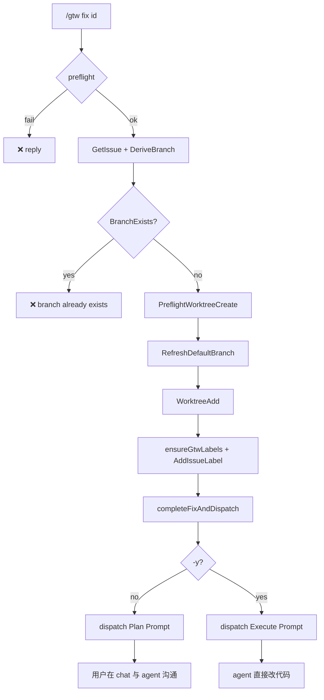

# F-XX: `/gtw fix` — Plan-first dispatch + 分支硬失败

> **Status**: 设计已定，待实现
>
> **Related**: [`F-gtw.md`](./F-gtw.md)、[`F-59-gtw-label-bootstrap.md`](./F-59-gtw-label-bootstrap.md)、[`internal/command/gtw/README.md`](../../internal/command/gtw/README.md)（IM 排版规约）
>
> **Code anchors**: `internal/command/gtw/fix.go`、`cmd.go::parseFixArgs`、`buildIssueDispatchText`

---

## 0. TL;DR

`/gtw fix <issue-id>` 的职责边界收窄为：

1. 拉取 issue → 建 worktree + 打 `nightme/wip` label
2. 组装 issue 信息（正文 + 附件 ContentFile）
3. 按 flag 选择 **Plan** 或 **Execute** prompt，`QueueUserMessage` 发给 agent

**到此结束。** 后续的「看方案、确认、调整、开工」全部在 **用户 ↔ agent 普通对话** 里完成。gtw **不提供** `/gtw proceed`，也不再 dispatch 第二次 prompt。

| 命令 | Agent 收到 | 用户下一步 |
|---|---|---|
| `/gtw fix <id>`（默认） | **Plan Prompt** — 只分析、出方案，**禁止改文件** | 在 chat 里回复 agent（「可以 / 按第 2 步做」等） |
| `/gtw fix <id> -y` | **Execute Prompt** — 直接实现修复 | 跟进 agent 进度 |

**Branch 已存在 → 硬失败**，不再提供 🆕 -v2 / 🔗 加入 / daemon recovery re-entry。

---

## 1. Motivation

### 1.1 旧行为的问题

v1.x Remote 模式在 worktree 就绪后立刻 dispatch 一条混合语义的 prompt（`buildIssueDispatchText` §Task 段同时写 "investigate **and implement**" 与 "reply when you have a plan"）。Agent 常直接改代码，用户无法在 IM 里先看方案再授权。

同时 §5.3.1 **branch-exists 决策卡**（🆕 用 -v2 新分支 / 🔗 加入现有 worktree）把「分支冲突」变成可跳过分支，增加状态机复杂度，且与「一个 issue 对应一条 fix 分支」的产品假设不一致。

### 1.2 设计原则

1. **gtw = infra + 一次性 issue 投递** — worktree、label、issue 组装、prompt 选择；judgment 与确认交给 agent + 用户对话。
2. **两套 prompt，一个组装函数** — metadata 段共享，仅 §Task 不同；由 `-y` 切换，不靠 gtw 二次 dispatch。
3. **Branch 冲突 = 错误** — 用户必须先 `/gtw close` 或手动处理已有 worktree，不能通过 gtw 隐式 recovery。
4. **flag 集合收窄为 `{ -y }`** — 原本设计里 `-f`（路径残留强制清理）与 `-y` 平级，但 branch-exists 硬失败之后 `-f` 仅剩的用途变成纯破坏性 auto-recovery，违反"出错让用户显式处理"原则。残留路径让用户自己 `git worktree remove --force <path>` 或 `/gtw close` 即可。

---

## 2. 命令面

### 2.1 Usage

```text
/gtw fix <issue-id>              # plan-first（默认）
/gtw fix <issue-id> -y           # 跳过 plan，直接 execute prompt
/gtw fix <issue-id> --yes        # 同 -y

/gtw fix --name <branch>         # local 模式（无 issue、无 agent dispatch，行为不变）
/gtw fix -n <branch>             # 同 --name
```

`parseFixArgs`（`cmd.go`）从 argv 任意位置剥离 `-y` / `--yes`，再交给 `parseFixMode`。

### 2.2 Flag 语义

| Flag | 字段 | 语义 | 作用层 |
|---|---|---|---|
| （无） | — | 默认 plan-first | Agent prompt |
| `-y` / `--yes` | `fixArgs.Yes` | dispatch **Execute Prompt** | 工作流 |

**关于 `--force` / `-f`**：F-XX 删除了原有的 `--force` flag。
它在新设计下只剩"路径残留强制清理"一种语义（即
`forceCleanWorktreePath`），与 branch-exists 硬失败结合后
变成纯破坏性 auto-recovery——违反了"出错让用户显式处理"
的原则。残留路径让用户自己用
`git worktree remove --force <path>` 或 `/gtw close` 处理。
详见 `wip/gtw-fix-execution.md` §1 item 2 + §10 决策记录。

**为何用 `-y`**：

- `nightme update --yes` 已有「跳过交互确认」语义，项目内一致。
- `-y` 的语义（"yes, go ahead"）清晰，不需要发明新 flag。
- 历史上还有 `-f` / `--force` flag（path 残留强制清理），已在 F-XX 删除。

---

## 3. Remote 模式主流程（§5.2）



相对 F-59 §2.3 的步骤编号，**dispatch 之前**的步骤不变（WorktreeAdd → ensureGtwLabels → AddIssueLabel → WriteGTWYml → slot.Store → success card）。**唯一变更**在 dispatch 内容与 branch-exists 策略。

### 3.1 Branch 已存在：硬失败（废除 §5.3.1）

**旧行为**（删除）：

- 同路径 → daemon recovery，`completeFixAndDispatch(..., skipDispatch=true)`
- 异路径 → `BranchExistsChoice` 决策卡（🆕 -v2 / 🔗 join / ❌ cancel）

**新行为**：`BranchExists == true` 时立即 `reply` 错误，不创建 worktree、不打 label、不 dispatch。

```text
❌ Branch `login-state-expiration` already exists
→ worktree: /path/to/worktrees/login-state-expiration   # WorktreeListPath 已知时
↳ finish or drop the active fix with `/gtw close`, then retry
```

Local 模式（`/gtw fix --name`）同样：branch 存在即失败，无决策卡。

**删除的符号**（实现阶段）：

- `emitBranchExistsDraft`、`BranchExistsChoice`、`DraftFixBranchExists`
- `action.go::executeBranchExistsAction`
- `runFixRemote` / `runFixLocal` 中的同路径 recovery 分支

**保留**：`WorktreeFailChoice` / `DraftFixWorktreeFail`（`git worktree add` 失败仍可 🔄 重试 / ❌ 取消）。

### 3.2 gtw 职责边界（dispatch 之后）

```
gtw                          agent + user chat
───                          ─────────────────
建 worktree                  agent 回复 Plan（默认）
打 label                     用户：「OK / 改一下第 3 步」
组装 issue blocks            agent 继续改代码（普通对话）
dispatch 一次 prompt
发 success card
（结束）
```

gtw **不会**：

- 监听 agent plan 完成事件
- 发 `/gtw proceed` 或第二次 Execute dispatch
- 用 Choice 卡做 plan 确认

用户确认 = **下一条 chat 消息**，走 runtime 常规定价 prompt 批次，与 `/gtw` 状态机无关。

---

## 4. 两套 Agent Prompt

实现：`IssueDispatchMode` + `buildIssueDispatchText(issue, branch, repo, mode)`。

Section 顺序稳定（与 v1 一致，便于 agent / 测试依赖）：

```text
📥 GitHub issue #N — <title>

## Metadata
- repo: ...
- branch: ...
- url: ...

## Description
<issue body verbatim>

## Attachments          # 仅有附件时
...

## Task
<Plan 或 Execute 正文>
```

附件仍为先下载到 worktree 下 `.nightme/attachments/<issue-id>/`，以 `ContentFile` blocks 跟在 text block 之后（`buildIssueDispatchBlocks`）。

### 4.1 Plan Prompt（默认，`-y` 未传）

```markdown
## Task
Analyze the issue above. Do NOT modify, create, or delete any files.

Deliver a structured execution plan:
1. Root cause hypothesis (with evidence from the description)
2. Files/modules likely affected
3. Proposed fix approach (step-by-step)
4. Test / verification strategy
5. Risks or open questions

You may read and explore the codebase in the prepared worktree.
Present the plan and STOP — wait for the user to reply in this chat
before making any code changes.
```

### 4.2 Execute Prompt（`-y` / `--yes`）

```markdown
## Task
Proceed to fix the issue above on the branch noted.
The worktree is prepared — investigate, implement the fix,
run relevant tests, and summarize what you changed.
```

用户通过 **flag** 表达「我已决定直接开工」，而非 gtw 二次投递。

---

## 5. Success Card（用户可见）

排版遵循 [`internal/command/gtw/README.md`](../../internal/command/gtw/README.md) Format 1。

### 5.1 Plan 模式（默认）

```text
✅ Fix #42 ready
→ branch:   `login-state-expiration`
→ worktree: /path/to/worktrees/login-state-expiration
→ issue:    owner/repo#42 [nightme/wip]
→ base:     abc1234                    # RefreshDefaultBranch 成功时
↳ agent is analyzing — review the plan in chat, then tell the agent when to proceed
```

### 5.2 Execute 模式（`-y`）

```text
✅ Fix #42 ready (direct execute)
→ branch:   `login-state-expiration`
→ worktree: /path/to/worktrees/login-state-expiration
→ issue:    owner/repo#42 [nightme/wip]
↳ agent is fixing now — follow progress in chat · `/gtw commit` + `/gtw push` when done
```

---

## 6. 与 F-59 / Local 模式的关系

| 能力 | Remote + F-59 | Local (`--name`) |
|---|---|---|
| `ensureGtwLabels` | ✅ | ❌ |
| `AddIssueLabel` | ✅ | ❌ |
| Agent dispatch | ✅ Plan / Execute | ❌（never dispatch） |
| Branch exists | ❌ 硬失败 | ❌ 硬失败 |

F-59 的 `rollbackLabelStep`、label bootstrap 顺序 **不变**；仅 dispatch 文案与 branch 策略变更。详见 [`F-59-gtw-label-bootstrap.md`](./F-59-gtw-label-bootstrap.md) §2.3（步骤 10 改为「按 mode dispatch Plan 或 Execute」）。

---

## 7. 实现清单

| 文件 | 改动 | PR |
|---|---|---|
| `cmd.go` | `fixArgs.Yes`；`parseFixArgs` 解析 `-y/--yes` 且显式 reject `--force/-f`；Usage；Factory.runFix 在 ModeLocal 时强制清零 `args.Yes` | A |
| `fix.go` | `IssueDispatchMode`；两套 prompt；删 `forceCleanWorktreePath` + `if force` 分支；re-entry 路径用 `DispatchPlan`；`runFixLocal` 删 `yes bool` 形参；branch exists → hard-fail；删 recovery / branch-exists draft | A + B |
| `types.go` | 加 `IssueDispatchMode` | A |
| `types.go` | 删 `DraftFixBranchExists` | B |
| `render.go` | success card hint（Plan / Execute）；删 `BranchExistsChoice` | A + B |
| `action.go` | 删 `executeBranchExistsAction` + `case DraftFixBranchExists` 分支 | B |
| `dispatch_test.go` | Plan / Execute prompt 单测；5 个原测试改形参 | A |
| `parse_fix_args_test.go` | 新增：`TestParseFixArgs_YesFlag` + `TestParseFixArgs_ForceFlagRejected` | A |
| `render_fix_success_test.go` | 新增：Plan / Execute success card 测试 + empty-baseSHA | A |
| `attachments_test.go` | 改形参加 `DispatchPlan` | A |
| `close_integration_test.go` | `args.Force` → `args.Yes` | A |
| `fix_remote_integration_test.go` | `drive()` 注释更新；新增 `TestFixRemote_BranchExists_HardFails_NoSideEffects` | A + B |
| `preflight_test.go` | 注释更新 | A |
| `action_test.go` | 删 `BranchExistsChoice` 相关测试 | B |
| `force_test.go` | 整个文件删（`forceCleanWorktreePath` 死代码） | A |
| feishu channel adapter | `gtwActionMap` 删 `branch-newv2` / `branch-join` 两个 key | B |

**明确不做**：

- `/gtw proceed`、`StatePlanning`、plan 确认 Choice
- branch-exists 决策卡与 -v2 变体分支
- daemon recovery 静默 re-entry

---

## 8. 测试要点

1. **branch 已存在** → `❌ Branch ... already exists`；无 worktree、无 dispatch
2. **默认 fix** → dispatch 含 `Do NOT modify`；不含 `Proceed to fix`
3. **`-y` fix** → dispatch 含 `Proceed to fix`；不含 `STOP`
4. **`-y` + worktree 已存在（同路径 re-entry）** → success card 用 Plan 措辞（不是 Execute），skipDispatch=true
5. **附件** → 两种 mode 均带 ContentFile
6. **worktree add 失败** → 仍走 `WorktreeFailChoice`（与 branch 无关）
7. **`--force` / `-f`** → 显式报错"unknown flag... removed in F-XX"（不静默 no-op）

---

## 9. 文档与 Channel 遗留

- **F-46 / feishu-rendering §3.3** 中的 `branch-exists` 决策卡描述为历史方案；实现本设计后仅 **worktree-fail** 仍走交互 Choice。
- **SPEC §2.6** Interactive Choices：gtw 决策面收窄为 worktree-fail 单场景。

---

## 10. 决策记录

| 决策 | 理由 |
|---|---|
| 不用 `/gtw proceed` | gtw 只投递一次 prompt；确认走普通 agent 对话 |
| 用 `-y` / `--yes` 表示直接 execute | 与 `nightme update --yes` 项目内一致；flag 语义清晰 |
| **删除 `--force` / `-f` 整个 flag** | branch-exists 硬失败后，`-f` 仅剩的"路径残留强制清理"语义变成纯破坏性 auto-recovery；让用户显式 `git worktree remove --force <path>` 或跑 `/gtw close` 更安全；flag 集合收窄到 `{ -y }` 一个 |
| **`--force` 显式报错而非 silent no-op** | trailing `--force` 会跟 issue id 并列存在，被 `parseFixMode` 默认分支当成合法 issue id——用户以为加了 flag 实际静默通过；显式报错"unknown flag... removed in F-XX"避免混淆 |
| branch 冲突硬失败 | 简化状态机；强制用户显式 `/gtw close` |
| 废除 daemon recovery re-entry | 与「branch 不跳过」同一原则；避免隐式 `skipDispatch` |
| re-entry 路径 success card 用 Plan 措辞 | skipDispatch=true 时不再发 prompt；用 Plan 措辞避免误导用户以为 agent 收到新 Execute Prompt |
| local mode 忽略 `-y` | `/gtw fix --name` 不 dispatch，Plan/Execute 无意义；Factory.runFix 在 ModeLocal 时强制清零 `args.Yes` |

---

## 11. 可选后续（非本期）

- `--no-dispatch`：只建 worktree，不发给 agent（`cmd.go` 注释已预留）
- Plan prompt 注入 repo 惯例（测试命令、目录结构）——仍只在 prompt 层
